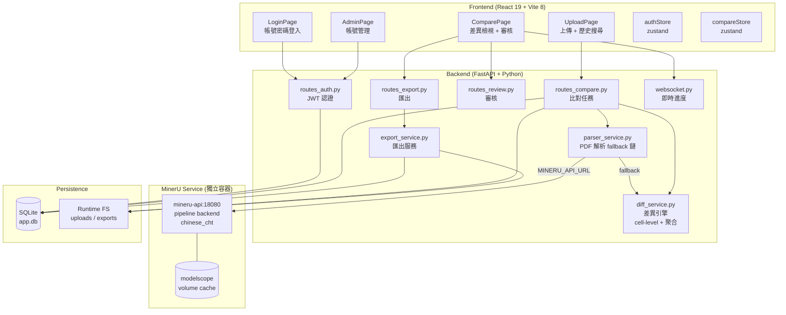
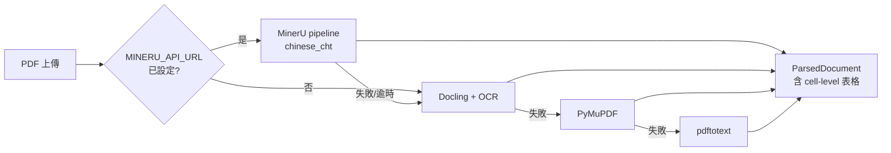
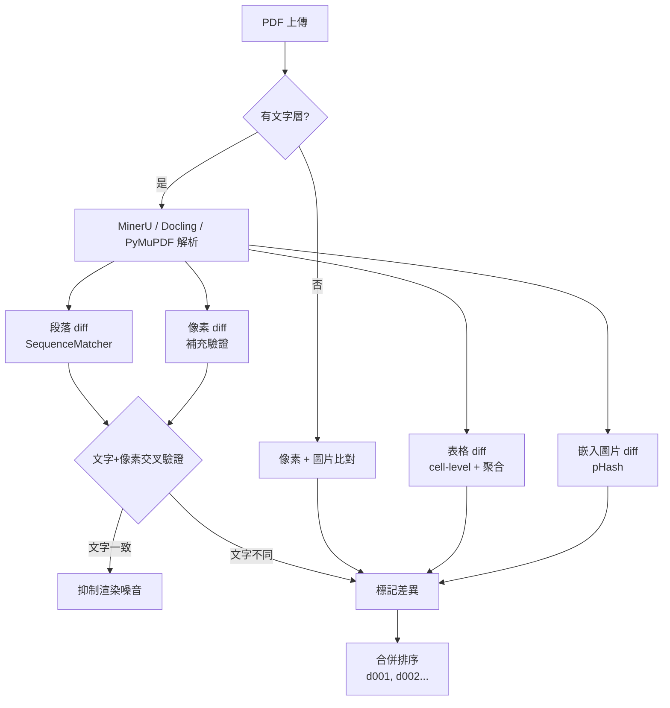
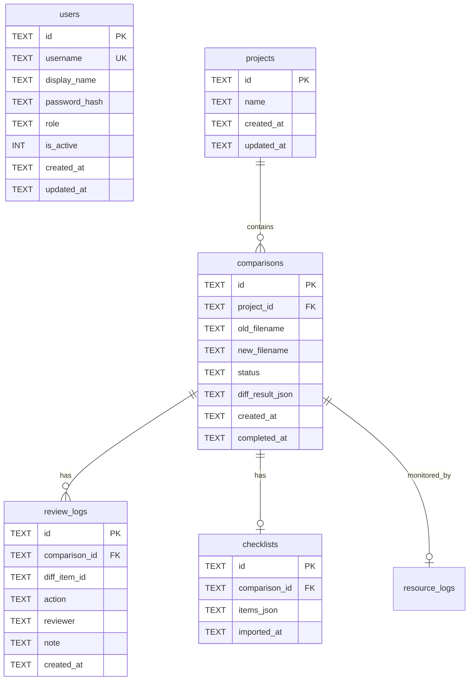

# PDF 差異比對系統 — 技術架構文件

> 版本: 2026-05-03 | 更新摘要: 導入 MinerU 高精度解析、cell-level 表格 diff、70% 聚合策略

---

## 1. 系統總覽



## 2. 認證架構

### 2.1 Token 流程

```
Client                         Server
  |                              |
  |-- POST /api/auth/login ----->|
  |   {username, password}       |
  |                              | verify_password(pwd, hash)
  |<---- {token, user} ---------|
  |                              |
  |-- GET /api/auth/me --------->|
  |   Authorization: Bearer xxx  |
  |                              | decode_token → get_user_by_id
  |<---- {user info} -----------|
```

### 2.2 密碼儲存

- 演算法: `PBKDF2-HMAC-SHA256`
- 迭代次數: `100,000`
- Salt: `secrets.token_hex(16)` (32 字元隨機 hex)
- 格式: `{salt}${hash}`
- 無外部套件依賴（使用 Python 標準庫 `hashlib` + `secrets`）

### 2.3 Token 結構

- 自製 JWT（無 PyJWT 依賴），使用 `HMAC-SHA256` 簽章
- Payload: `{sub: user_id, username, role, exp}`
- 有效期: 7 天
- 前端存放: `localStorage`

### 2.4 權限模型

| 角色 | 登入 | 上傳比對 | 審核差異 | 帳號管理 |
|------|------|----------|----------|----------|
| admin | ✅ | ✅ | ✅ | ✅ |
| reviewer | ✅ | ✅ | ✅ | ❌ |

## 3. 差異引擎架構

### 3.1 解析 fallback 鏈



### 3.2 四路聯集比對策略



### 3.3 Cell-Level 表格 diff 與聚合策略

MinerU 輸出的表格含完整 rowspan/colspan HTML，解析為 DataFrame 後執行逐格比對：

```
for each (row, col) in merged grid:
    if old_cell != new_cell → record DiffItem with cell bbox

change_ratio = changed_cells / total_cells
if change_ratio >= 0.70:
    # 整表替換：合併為 1 筆 DiffItem，bbox = 整張表
    return [整表替換 DiffItem]
else:
    # 回傳所有格層級 DiffItem
    return pending_cell_diffs
```

**70% 閾值理由**：保險 DM 費率表一旦改版通常整欄數值都改，cell-level 標記反而產生噪音；低於 70% 的局部修改（如改 1-3 個費率數字）才有格層級精確定位的價值。

### 3.4 誤判抑制機制 (2026-04-24 更新)

| 過濾器 | 說明 | 閾值 |
|--------|------|------|
| 像素門檻 | 偵測亮度差異門檻 (0-255) | 15 (原 30) |
| NCC 結構相似度 | 像素區域的正規化交叉相關 | > 0.98 抑制 |
| 文字模糊匹配 | 像素區域內的文字 SequenceMatcher 比率 | ≥ 0.95 抑制 |
| 最小面積 | 變更像素數量 | < 200 px 忽略 (原 800) |
| 噪點比率 | 實際變更像素 / 區域總像素 | < 2% 忽略 (原 5%) |
| DPI | 渲染解析度 | 200 (原 150) |
| 深度正規化 | NFKC + 去除零寬字元 + 統一空格/破折號 | — |

### 3.5 嵌入圖片與像素比對

- **像素比對**: 文字 PDF 也會執行像素比對，門檻調降至 15 以捕捉細微變更（如標點、線條）。
- **嵌入圖片比對**: 使用 `imagehash` 提取 PDF 內部原始圖檔並比對 pHash，漢明距離 > 0 視為變更。
- **交叉驗證**: 兩側文字 95% 以上一致時，自動抑制像素差異，避免 PDF 重新輸出時的渲染噪音。

## 4. 前端架構

### 4.1 路由結構

```
/login          → LoginPage (公開)
/               → UploadPage (需登入)
/compare/:id    → ComparePage (需登入)
/admin          → AdminPage (需 admin)
/popout/:id/:v  → PopoutPage (公開)
```

### 4.2 狀態管理

| Store | 檔案 | 用途 |
|-------|------|------|
| authStore | `stores/authStore.ts` | token / user / isAuthenticated |
| compareStore | `stores/compareStore.ts` | diff report / search / filter / UI 狀態 |

### 4.3 響應式 DiffPopup

- `max-h-[90vh]` + `flex flex-col`
- 固定 header (diff type + ID)
- 可滾動中間內容 (`overflow-y-auto`)
- 固定 footer (確認/標記/關閉按鈕)
- 小螢幕: 原始/修訂內容堆疊 (`grid-cols-1`)
- 審核人員欄位自動帶入 `authUser.display_name`

## 5. 匯出格式

| 格式 | 端點 | 說明 |
|------|------|------|
| 差異標註 PDF | `/api/export/{id}/pdf` | 在新版 PDF 上疊加彩色差異標記 |
| 檢核報告 PDF | `/api/export/{id}/report` | 摘要 + 明細文字報告 |
| Excel 明細 | `/api/export/{id}/excel` | diffs / checklist / summary 三工作表 |
| 審核 Log CSV | `/api/export/{id}/log-csv` | 每筆審核動作一列 |
| 完整 Log JSON | `/api/export/{id}/log` | 原始結構化資料 |
| **審核紀錄 TXT** | `/api/export/{id}/log-txt` | 人類可讀純文字表格 (新增) |

### 5.1 TXT 匯出格式範例

```
════════════════════════════════════════════════════════
  PDF 差異比對 — 審核檢視紀錄
════════════════════════════════════════════════════════

■ 基本資訊
  比對 ID:    abc-123
  舊版檔案:   產品DM_v1.pdf
  新版檔案:   產品DM_v2.pdf

■ 差異摘要
  總差異數:   12
  已確認:     8
  已標記:     2
  待審核:     2

■ 差異明細
  ---------------------------------------------------------------
  #    類型      原始內容        修訂內容        審核狀態  審核人員
  ---------------------------------------------------------------
  1    數值修改  3.5%            4.0%            已審核    王小明
  2    文字修改  保障            保 障           已審核    李小華
  ---------------------------------------------------------------

■ 審核操作紀錄
  1. [2026-04-24 13:05] 王小明 → 確認 d001 (備註: 數值正確更新)
```

## 6. 資料庫 Schema



## 7. 硬體資源監控

每次 PDF 比對任務自動記錄：
- CPU 使用率（每 2 秒取樣）
- 記憶體使用量（RSS MB）
- 處理時間
- 系統資訊（架構、CPU 核心數、總記憶體）

API:
- `GET /api/system/resource-logs` — 最近 50 筆摘要
- `GET /api/system/resource-logs/{task_id}` — 單一任務含取樣明細

用途：評估部署到 OCI ARM / 地端筆電的可行性

## 8. 部署架構

```
Docker Compose
├── mineru-api (mineru-api:pipeline)
│   ├── mineru-api --pipeline-backend pipeline :18080
│   └── Volume: mineru_model_cache → /root/.cache/modelscope
│
├── backend (pdf-check-backend:latest)
│   ├── FastAPI (uvicorn :8000)
│   │   ├── Backend API (/api/*)
│   │   ├── WebSocket (/ws/*)
│   │   └── Static Files (React build → /static)
│   ├── MINERU_API_URL=http://mineru-api:18080
│   └── Volume: backend_runtime → /app/runtime
│       ├── uploads/old, uploads/new
│       ├── exports/
│       ├── snapshots/, crops/
│       └── app.db
│
└── Network: internal (bridge)
    └── backend depends_on mineru-api (service_healthy)
```

### 8.1 MinerU 服務建構

`mineru/Dockerfile` 在 build 時預下載模型（`mineru-models-download -s modelscope -m pipeline`），掛載 volume 後重建不需重複下載。

```bash
# 僅重建 backend（不影響 MinerU 模型）
docker compose build backend && docker compose up -d backend

# 完整重建（模型已在 volume，不會重新下載）
docker compose up --build -d
```

### 8.2 MinerU 繁體中文設定

`parser_service.py` 呼叫 MinerU API 時固定傳入：

```json
{
  "backend": "pipeline",
  "lang_list": "chinese_cht",
  "parse_method": "auto",
  "return_content_list": "true"
}
```

`chinese_cht` 替代預設 `ch`，可將繁簡混用段落從 9 段降至 2 段以下。

支援離線部署：先在有網路環境 build image + 預載模型，再匯出到離線環境。

## 9. 安全考量

| 項目 | 現況 | 說明 |
|------|------|------|
| 密碼儲存 | PBKDF2 + salt | 標準安全等級 |
| Token | HMAC-SHA256 自簽 | 適合內網部署 |
| CORS | 允許所有來源 | 本地部署不需限制 |
| HTTPS | 未啟用 | Docker 內網不需要 |
| 預設帳號 | admin/admin123 | **首次登入後應修改密碼** |

## 10. 變更清單

### 2026-05-03 — MinerU 整合、cell-level 表格 diff

#### 新增/修改

| 檔案 | 動作 | 說明 |
|------|------|------|
| `mineru/Dockerfile` | 新增 | MinerU pipeline 容器，預載 modelscope 模型 |
| `docker-compose.yml` | 修改 | 新增 `mineru-api` service + healthcheck + volume |
| `backend/config.py` | 修改 | 新增 `mineru_api_url` 設定（空值 = 停用） |
| `backend/services/parser_service.py` | 修改 | 新增 `_parse_via_mineru()`、`_mineru_bbox_to_bbox()`、`_normalize_mineru_text()`；fallback 鏈改為 MinerU → Docling → PyMuPDF → pdftotext |
| `backend/services/diff_service.py` | 修改 | 新增 `_diff_table_cells()` cell-level diff + 70% 聚合策略；`diff_tables()` 改用新函式 |
| `backend/requirements.txt` | 修改 | 已含 `requests`, `lxml`（MinerU HTTP client 依賴） |

#### 測試結果（15/15 通過）

- 自我對比（相同 PDF）→ 0 diffs ✓
- 整表替換（100% 格變更）→ 單一「整表替換」DiffItem ✓
- 局部修改（1 格）→ cell-level DiffItem ✓
- HTML table → DataFrame 解析 ✓
- NFKC 正規化 ✓

---

### 2026-04-24 — 帳號管理、響應式 UI、TXT 匯出、誤判優化

#### 前端

| 檔案 | 動作 | 說明 |
|------|------|------|
| `App.tsx` | 修改 | 新增 ProtectedRoute、login/admin 路由 |
| `DiffPopup.tsx` | 修改 | 響應式佈局 + 自動帶入審核帳號 |
| `UploadPage.tsx` | 修改 | 搜尋框 + 列表呈現 + 審核人員顯示 |
| `ComparePage.tsx` | 修改 | 使用者資訊 + 登出 + TXT 匯出選項 |
| `LoginPage.tsx` | 新增 | 登入頁面 |
| `AdminPage.tsx` | 新增 | 帳號管理頁面 |

#### 後端

| 檔案 | 動作 | 說明 |
|------|------|------|
| `diff_service.py` | 修改 | **Diff 引擎大改**：新增 pHash 圖片比對、調降門檻 (15)、面積 (200)、提高 NCC (0.98) |
| `resource_monitor.py` | 新增 | CPU/RAM 監控 + 持久化 |
| `routes_auth.py` | 新增 | 認證 API (login / users CRUD) |
| `export_service.py` | 修改 | 新增 TXT 審核日誌匯出 |
| `database.py` | 修改 | users + resource_logs + 頁面記錄支援 |
| `requirements.txt` | 修改 | 新增 `imagehash` 套件 |
