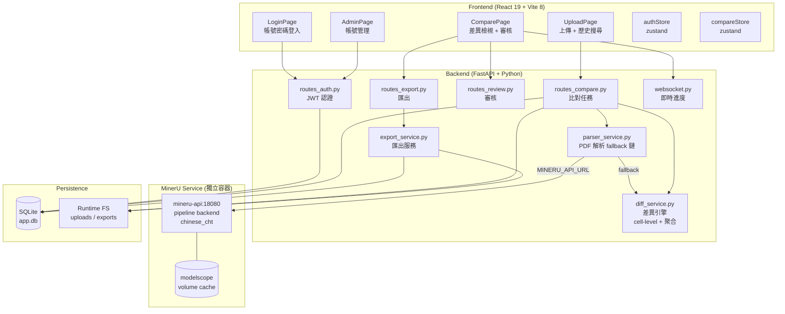
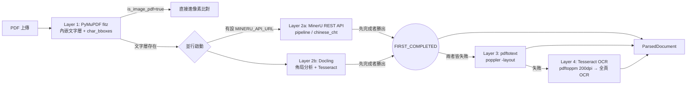
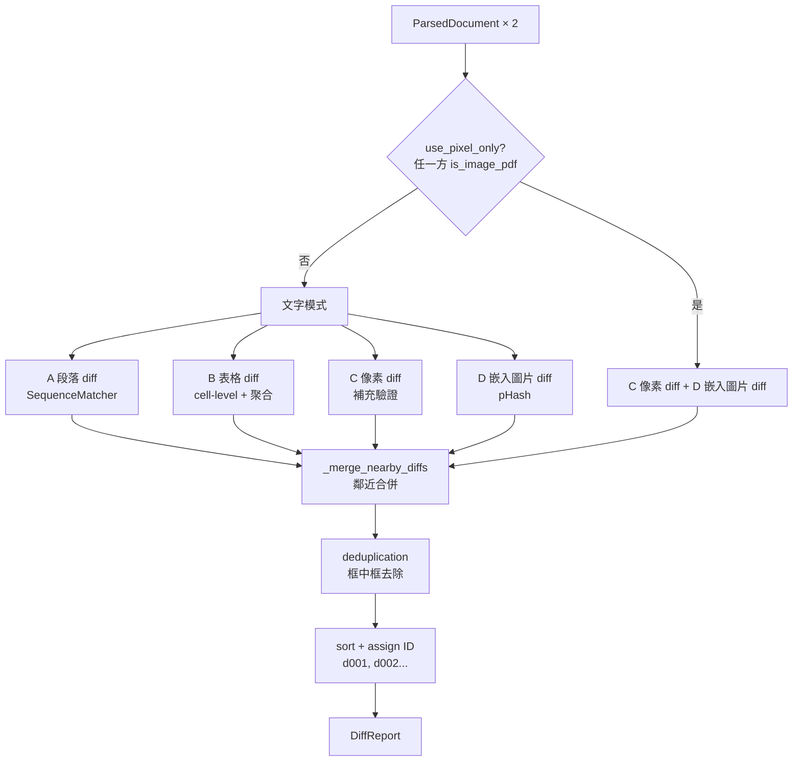
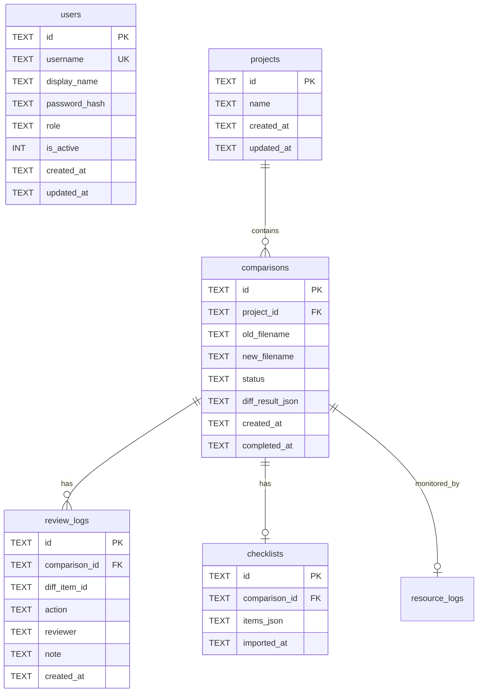

# PDF 差異比對系統 — 技術架構文件

> 版本: 2026-05-08 | 更新摘要: 新增 SSIM 子區域變更定位、區域性 Tesseract OCR 整合、核心引擎優化

---

## 1. 系統總覽



## 2. 認證架構

### 2.1 Token 流程

```
Client                         Server
  |                              |
  |-- POST /api/auth/login ----->|
  |   {username, password}       |
  |                              | verify_password(pwd, hash)
  |<---- {token, user} ---------|
  |                              |
  |-- GET /api/auth/me --------->|
  |   Authorization: Bearer xxx  |
  |                              | decode_token → get_user_by_id
  |<---- {user info} -----------|
```

### 2.2 密碼儲存

- 演算法: `PBKDF2-HMAC-SHA256`
- 迭代次數: `100,000`
- Salt: `secrets.token_hex(16)` (32 字元隨機 hex)
- 格式: `{salt}${hash}`
- 無外部套件依賴（使用 Python 標準庫 `hashlib` + `secrets`）

### 2.3 Token 結構

- 自製 JWT（無 PyJWT 依賴），使用 `HMAC-SHA256` 簽章
- Payload: `{sub: user_id, username, role, exp}`
- 有效期: 7 天
- 前端存放: `localStorage`

### 2.4 權限模型

| 角色 | 登入 | 上傳比對 | 審核差異 | 帳號管理 |
|------|------|----------|----------|----------|
| admin | ✅ | ✅ | ✅ | ✅ |
| reviewer | ✅ | ✅ | ✅ | ❌ |

## 3. 差異引擎架構

### 3.1 解析 fallback 鏈（4 層降級）



> **並行策略（2026-05-04）**：Layer 2a 與 2b 同時啟動（`ThreadPoolExecutor(max_workers=2)`），取最先成功回傳的結果（`FIRST_COMPLETED`）。落敗的執行緒在背景繼續跑完但結果被丟棄（`shutdown(wait=False)`）。MinerU 的 300s timeout 不再阻塞 Docling 啟動。若 MinerU 未設定（`MINERU_API_URL` 為空），只提交 Docling，行為與舊版相同。

#### Layer 1 — PyMuPDF（fitz）

永遠第一個執行，無論後續走哪條路都以此結果為基礎。

| 項目 | 說明 |
|------|------|
| 用途 | 直接讀取 PDF 內嵌向量文字層，不做 OCR |
| 關鍵特性 | 用 `rawdict` 格式取得**字元級 BBox**，是之後精準標記差異位置的核心資料 |
| 圖片型偵測 | 每頁 < 10 字元 且 含圖片，且 ≥ 70% 頁面符合 → 標記 `is_image_pdf=True` |
| is_image_pdf 後果 | 直接跳到像素比對，完全不啟動 OCR（避免圖片 PDF 做 OCR 產生大量雜訊）|
| 座標系統 | PyMuPDF 使用 top-left origin，轉換為 PDF 標準 bottom-left origin |
| 輸出 | `ParsedParagraph`（含 `char_bboxes: list[BBox]`） |

#### Layer 2a — MinerU REST API

呼叫同一個 docker-compose 中的 `mineru-api-minerU` 容器（port 18080）。

| 項目 | 說明 |
|------|------|
| 用途 | 複雜表格偵測（rowspan/colspan）、繁/簡中文混排 OCR |
| 呼叫參數 | `backend="pipeline"`, `lang_list="chinese_cht"`, `parse_method="auto"` |
| 表格解析 | 回傳 HTML → `pd.read_html()` → DataFrame |
| 限制 | HTML 不含格子座標，cell_bboxes 為空（整表 bbox 仍有） |
| 文字正規化 | NFKC + strip，合併繁簡字形變體 |
| Timeout | 300 秒 |
| 輸出 | `ParsedTable`（無 cell_bboxes）、`ParsedParagraph` |

#### Layer 2b — Docling

MinerU 不可用或失敗時的備案，也是本地端的主要 AI 佈局分析器。

| 項目 | 說明 |
|------|------|
| 用途 | 佈局分析 + Tesseract OCR，可取得**格子級 BBox** |
| OCR 策略 | `force_full_page_ocr=False`，只對真正圖片頁做 OCR，避免對有文字層的頁面重複辨識 |
| 語言支援 | `chi_tra + chi_sim + eng`（可透過 `OCR_LANGS` env var 調整） |
| 優勢 | `table_item.data.table_cells` 提供每格座標，diff 可以精準框出哪個格子改了 |
| 座標處理 | 讀取 `coord_origin` 屬性，同時支援 top/bottom origin |
| 輸出 | `ParsedTable`（含 `cell_bboxes: dict[(row,col), BBox]`）、`ParsedParagraph` |

#### Layer 3 — pdftotext（poppler）

| 項目 | 說明 |
|------|------|
| 用途 | 純文字抽取，保留排版（`-layout` flag） |
| 限制 | 無表格結構、BBox 為合成值（按行均分頁面高度） |
| 輸出 | `ParsedParagraph`（合成 BBox，精準度低） |

#### Layer 4 — Tesseract OCR（最後手段）

| 項目 | 說明 |
|------|------|
| 用途 | 所有前三層都失敗時，對完全無文字層的 PDF 做全頁光學識別 |
| 流程 | `pdftoppm -r 200 -png` → Tesseract psm=6 |
| 限制 | BBox 為合成值，無表格，速度最慢 |

### 3.2 ParsedDocument 資料結構

```python
@dataclass
class ParsedParagraph:
    text: str                              # 文字內容
    bbox: BBox                             # 所在位置（bottom-left origin, pt）
    char_bboxes: list[BBox] | None         # 字元級座標（僅 fitz 層提供）
    style: str | None                      # 保留欄位

@dataclass
class ParsedTable:
    dataframe: pd.DataFrame                # 表格內容（cells）
    bbox: BBox                             # 表格整體位置
    caption: str | None                    # 表格標題
    header_rows: int                       # 標題列數
    cell_bboxes: dict[(row, col), BBox]    # 格子座標（僅 Docling 提供）

@dataclass
class ParsedDocument:
    pages: int
    paragraphs: list[ParsedParagraph]
    tables: list[ParsedTable]
    raw_json: dict                         # 解析引擎原始輸出
    markdown_text: str | None              # Markdown 全文（MinerU / Docling）
    is_image_pdf: bool                     # True → 跳過文字比對，直接像素 diff
```

所有 BBox 座標系統統一為 PDF 標準（bottom-left origin，單位 pt = 1/72 英寸）：

| 解析引擎 | 原始座標系 | 轉換函式 |
|---------|-----------|---------|
| PyMuPDF (fitz) | top-left origin | `page_height - y_top` |
| MinerU | top-left origin | `_mineru_bbox_to_bbox()` |
| Docling | 彈性（讀 coord_origin）| `_bbox_from_docling()` |

### 3.2b 四路聯集比對策略



#### [A] 文字 Diff — `diff_paragraphs()`

**Tokenization**（兩種模式混用）：
- 英數詞：`[a-zA-Z0-9.,]+`（整詞不拆）
- CJK 字符：每個字元獨立 token

**文字正規化** `_deep_normalize()`：

| 步驟 | 說明 |
|------|------|
| NFKC | fi→fi、全形→半形、合字拆解 |
| 零寬字元 | 移除 soft hyphen, ZWNJ, ZWJ, BOM, word joiner |
| 空白統一 | U+00A0, U+202F, U+2009–U+2004 → U+0020 |
| 破折號統一 | en-dash, em-dash, minus 變體 → 一般 hyphen |
| 最終 | `collapse whitespace` |

**BBox 精度策略**（依資料來源）：
- 有 `char_bboxes`（fitz 層）→ 字元級精準定位
- 無 `char_bboxes` → 在段落 bbox 內線性插值

信心值：0.85

#### [B] 表格 Diff — `diff_tables()`

詳見 §3.3（cell-level diff + 70% 聚合策略）。

#### [C] 像素 Diff — `diff_pixels()`

| 步驟 | 說明 |
|------|------|
| 渲染 | 兩份 PDF 渲染為灰階 numpy uint8（200 DPI）|
| 差分 | `\|arr_old - arr_new\|`，二值化（threshold=15）|
| 形態學膨脹 | scipy，合併 4px 內鄰近像素 |
| 連通元件 | scipy `label()`，找出差異區塊 |
| 面積過濾 | < 200 px² 忽略 |
| NCC 過濾 | 正規化交叉相關 > 0.98 → 純位移噪訊，忽略 |
| 文字提取 | ① 從 PDF 文字層取該區域文字；② 沒有則對 patch 做 Tesseract OCR |
| 信心值 | 0.95 |

與文字 diff 的關係：文字 PDF 模式下，像素 diff 是**補充路徑**，專門抓語義 diff 抓不到的圖形變化、公式位移、排版調整。

#### [D] 嵌入圖片 Diff — `diff_images()`

| 步驟 | 說明 |
|------|------|
| 提取 | 從兩份 PDF 提取所有嵌入圖片 |
| 位置匹配 | IoU（Intersection over Union）≥ 0.8 → 視為同一張圖 |
| 感知雜湊 (pHash) | Hamming distance > 4 or 尺寸差 > 2px → 標記 `IMAGE_DIFF` (整體變更) |
| **SSIM 子區域定位** | 對 pHash 一致的圖片執行 **Structural Similarity** 滑動窗口分析，定位小區域細微變動 |
| **區域性 OCR** | 針對 SSIM 標記的差異子區域執行 **Tesseract OCR**，讀取舊/新文字內容 |
| 過濾 | 跳過佔頁面 ≥ 80% 的背景圖；OCR 結果若 100% 一致則抑制誤報 |
| 信心值 | 0.85–0.90 |

> **SSIM 與 OCR 協作 (2026-05-08)**：解決了以往感知雜湊只能偵測「大改」的問題。現在即使圖片內只改了一個數字（如：費率圖表、說明小字），也能透過 SSIM 精確定位變更區域，並用 Tesseract 讀出具體的修改內容（例如：2.4% → 2.8%）。

#### 後處理：鄰近合併與去重

**`_merge_nearby_diffs()`**（2026-05-04 新增）

解決解析器將一段連續文字切成多個獨立 BBox 的問題（例如「Control NO : 2312-2512-0P2」被拆成 3 段）。

- 對象：僅 `TEXT_MODIFIED`、`NUMBER_MODIFIED`
- 演算法：Union-Find with path compression
- 合併條件：兩 BBox 的 Euclidean gap ≤ 50pt（約 17.6mm）
- 合併後：old/new 文字用空格串接，bbox 取聯集，信心值取最大值

**`merge_diff_results()` 去重（框中框）**

- 若 bbox_j 完全在 bbox_i 內，且 area(i) > area(j) × 1.2 → 移除 j
- 最終依 `(page, -y1)` 排序，賦予 `d001, d002...` ID

### 3.2c 技術互補關係

| 情境 | 主力技術 | 補充技術 | 說明 |
|------|---------|---------|------|
| 一般文字 PDF | fitz（文字）| 像素 diff | 像素補抓圖形/排版差異 |
| 圖片型 PDF | 像素 diff | 嵌入圖片 pHash | 完全繞過文字層 |
| 複雜中文表格 | MinerU（HTML 解析）| Docling（有 cell BBox）| MinerU 快，Docling 精確 |
| 表格格子定位 | Docling cell_bboxes | table-level bbox 降級 | MinerU 無 cell 座標 |
| 文字精準定位 | fitz char_bboxes | 線性插值降級 | 其他引擎無字元座標 |
| 相鄰碎片合併 | _merge_nearby_diffs | — | 解決解析器過度切割問題 |
| 噪訊過濾 | NCC > 0.98 | 文字模糊匹配 ≥ 0.95 | 抑制 PDF 重新輸出的渲染差異 |

### 3.3 Cell-Level 表格 diff 與聚合策略

MinerU 輸出的表格含完整 rowspan/colspan HTML，解析為 DataFrame 後執行逐格比對：

```
for each (row, col) in merged grid:
    if old_cell != new_cell → record DiffItem with cell bbox

change_ratio = changed_cells / total_cells
if change_ratio >= 0.70:
    # 整表替換：合併為 1 筆 DiffItem，bbox = 整張表
    return [整表替換 DiffItem]
else:
    # 回傳所有格層級 DiffItem
    return pending_cell_diffs
```

**70% 閾值理由**：保險 DM 費率表一旦改版通常整欄數值都改，cell-level 標記反而產生噪音；低於 70% 的局部修改（如改 1-3 個費率數字）才有格層級精確定位的價值。

### 3.4 誤判抑制機制 (2026-04-24 更新)

| 過濾器 | 說明 | 閾值 |
|--------|------|------|
| 像素門檻 | 偵測亮度差異門檻 (0-255) | 15 (原 30) |
| NCC 結構相似度 | 像素區域的正規化交叉相關 | > 0.98 抑制 |
| 文字模糊匹配 | 像素區域內的文字 SequenceMatcher 比率 | ≥ 0.95 抑制 |
| 最小面積 | 變更像素數量 | < 200 px 忽略 (原 800) |
| 噪點比率 | 實際變更像素 / 區域總像素 | < 2% 忽略 (原 5%) |
| DPI | 渲染解析度 | 200 (原 150) |
| 深度正規化 | NFKC + 去除零寬字元 + 統一空格/破折號 | — |

### 3.5 嵌入圖片與像素比對

- **像素比對**: 文字 PDF 也會執行像素比對，門檻調降至 15 以捕捉細微變更（如標點、線條）。
- **嵌入圖片比對**: 使用 `imagehash` 提取 PDF 內部原始圖檔並比對 pHash，漢明距離 > 0 視為變更。
- **交叉驗證**: 兩側文字 95% 以上一致時，自動抑制像素差異，避免 PDF 重新輸出時的渲染噪音。

## 4. 前端架構

### 4.1 路由結構

```
/login          → LoginPage (公開)
/               → UploadPage (需登入)
/compare/:id    → ComparePage (需登入)
/admin          → AdminPage (需 admin)
/popout/:id/:v  → PopoutPage (公開)
```

### 4.2 狀態管理

| Store | 檔案 | 用途 |
|-------|------|------|
| authStore | `stores/authStore.ts` | token / user / isAuthenticated |
| compareStore | `stores/compareStore.ts` | diff report / search / filter / UI 狀態 |

### 4.3 響應式 DiffPopup

- `max-h-[90vh]` + `flex flex-col`
- 固定 header (diff type + ID)
- 可滾動中間內容 (`overflow-y-auto`)
- 固定 footer (確認/標記/關閉按鈕)
- 小螢幕: 原始/修訂內容堆疊 (`grid-cols-1`)
- 審核人員欄位自動帶入 `authUser.display_name`

## 5. 匯出格式

| 格式 | 端點 | 說明 |
|------|------|------|
| 差異標註 PDF | `/api/export/{id}/pdf` | 在新版 PDF 上疊加彩色差異標記 |
| 檢核報告 PDF | `/api/export/{id}/report` | 摘要 + 明細文字報告 |
| Excel 明細 | `/api/export/{id}/excel` | diffs / checklist / summary 三工作表 |
| 審核 Log CSV | `/api/export/{id}/log-csv` | 每筆審核動作一列 |
| 完整 Log JSON | `/api/export/{id}/log` | 原始結構化資料 |
| **審核紀錄 TXT** | `/api/export/{id}/log-txt` | 人類可讀純文字表格 (新增) |

### 5.1 TXT 匯出格式範例

```
════════════════════════════════════════════════════════
  PDF 差異比對 — 審核檢視紀錄
════════════════════════════════════════════════════════

■ 基本資訊
  比對 ID:    abc-123
  舊版檔案:   產品DM_v1.pdf
  新版檔案:   產品DM_v2.pdf

■ 差異摘要
  總差異數:   12
  已確認:     8
  已標記:     2
  待審核:     2

■ 差異明細
  ---------------------------------------------------------------
  #    類型      原始內容        修訂內容        審核狀態  審核人員
  ---------------------------------------------------------------
  1    數值修改  3.5%            4.0%            已審核    王小明
  2    文字修改  保障            保 障           已審核    李小華
  ---------------------------------------------------------------

■ 審核操作紀錄
  1. [2026-04-24 13:05] 王小明 → 確認 d001 (備註: 數值正確更新)
```

## 6. 資料庫 Schema



## 7. 硬體資源監控

每次 PDF 比對任務自動記錄：
- CPU 使用率（每 2 秒取樣）
- 記憶體使用量（RSS MB）
- 處理時間
- 系統資訊（架構、CPU 核心數、總記憶體）

API:
- `GET /api/system/resource-logs` — 最近 50 筆摘要
- `GET /api/system/resource-logs/{task_id}` — 單一任務含取樣明細

用途：評估部署到 OCI ARM / 地端筆電的可行性

## 8. 部署架構

```
Docker Compose
├── mineru-api (mineru-api:pipeline)
│   ├── mineru-api --pipeline-backend pipeline :18080
│   └── Volume: mineru_model_cache → /root/.cache/modelscope
│
├── backend (pdf-check-backend:latest)
│   ├── FastAPI (uvicorn :8000)
│   │   ├── Backend API (/api/*)
│   │   ├── WebSocket (/ws/*)
│   │   └── Static Files (React build → /static)
│   ├── MINERU_API_URL=http://mineru-api:18080
│   └── Volume: backend_runtime → /app/runtime
│       ├── uploads/old, uploads/new
│       ├── exports/
│       ├── snapshots/, crops/
│       └── app.db
│
└── Network: internal (bridge)
    └── backend depends_on mineru-api (service_healthy)
```

### 8.1 MinerU 服務建構

`mineru/Dockerfile` 在 build 時預下載模型（`mineru-models-download -s modelscope -m pipeline`），掛載 volume 後重建不需重複下載。

```bash
# 僅重建 backend（不影響 MinerU 模型）
docker compose build backend && docker compose up -d backend

# 完整重建（模型已在 volume，不會重新下載）
docker compose up --build -d
```

### 8.2 MinerU 繁體中文設定

`parser_service.py` 呼叫 MinerU API 時固定傳入：

```json
{
  "backend": "pipeline",
  "lang_list": "chinese_cht",
  "parse_method": "auto",
  "return_content_list": "true"
}
```

`chinese_cht` 替代預設 `ch`，可將繁簡混用段落從 9 段降至 2 段以下。

支援離線部署：先在有網路環境 build image + 預載模型，再匯出到離線環境。

## 9. 安全考量

| 項目 | 現況 | 說明 |
|------|------|------|
| 密碼儲存 | PBKDF2 + salt | 標準安全等級 |
| Token | HMAC-SHA256 自簽 | 適合內網部署 |
| CORS | 允許所有來源 | 本地部署不需限制 |
| HTTPS | 未啟用 | Docker 內網不需要 |
| 預設帳號 | admin/admin123 | **首次登入後應修改密碼** |

## 10. 變更清單

### 2026-05-08 — 核心引擎升級：SSIM 子區域定位 + 區域性 OCR

#### 新增/修改

| 檔案 | 動作 | 說明 |
|------|------|------|
| `backend/services/diff_service.py` | 修改 | 新增 `_ssim_map()` 與 `_locate_image_changes()`：實作滑動窗口 SSIM 分析，精確定位圖片內的細微變更區域。 |
| `backend/services/diff_service.py` | 修改 | 新增 `_ocr_tile_pair()`：封裝 Tesseract OCR 流程，對 SSIM 標記區域進行文字讀取與正規化對比。 |
| `backend/services/diff_service.py` | 修改 | 優化 `diff_images()`：整合 SSIM/OCR 邏輯，使圖片內文字修改能以 `TEXT_MODIFIED` 類型呈現。 |
| `README.md` | 修改 | 更新最新更新摘要，補充 SSIM 技術細節。 |

---

### 2026-05-04 — 三項效能優化 + 鄰近差異合併 + docker port 調整

#### 新增/修改

| 檔案 | 動作 | 說明 |
|------|------|------|
| `backend/services/diff_service.py` | 修改 | **#5** `_merge_nearby_diffs()` 配對迴圈改為 sliding window：先按 `(page, y0)` 排序，當 `bj.y0 > bi.y1 + gap_threshold` 即 break，O(n²)→O(n log n + n·w) |
| `backend/services/diff_service.py` | 修改 | **#4** `diff_pixels()` 新增兩階段掃描：Phase 1 以 72 DPI 快速找出有差異的頁（min\_area 等比縮放），Phase 2 只對差異頁做完整 200 DPI 分析 |
| `backend/services/parser_service.py` | 修改 | **#2** `parse_pdf()` 表格解析改為 MinerU + Docling 並行（`ThreadPoolExecutor(max_workers=2)` + `FIRST_COMPLETED`）；取最先成功者，`shutdown(wait=False)` 讓落敗執行緒在背景完成，不阻塞主流程；MinerU 300s timeout 不再阻塞 Docling 啟動 |
| `backend/services/diff_service.py` | 修改 | 新增 `_merge_nearby_diffs()`：對空間鄰近的 TEXT/NUMBER diff 做 Union-Find 合併（gap ≤ 50pt） |
| `docker-compose.yml` | 修改 | backend expose 改為 `ports: 8001:8000`；`internal` network 從 `external: true` 改為 `driver: bridge` |
| `一鍵啟動PDF比對系統.bat` | 修改 | health check / 提示 URL / 自動開啟瀏覽器全改為 port 8001 |
| `start-mac.command` | 修改 | 同上 |
| `caddy_update.txt` | 修改 | `reverse_proxy pdf-check-minerU:8000` → `localhost:8001` |
| `frontend/vite.config.ts` | 修改 | dev proxy target 全改為 `localhost:8001` |

#### 優化預期效益

| 優化 | 情境 | 預期改善 |
|------|------|---------|
| #2 並行解析 | MinerU 回應慢或超時 | 解析時間縮短至 Docling 完成時間（不再等 300s timeout）|
| #4 動態 DPI | 僅 1-2 頁有差異的文件 | 像素比對時間降低 50–80% |
| #5 Sliding Window | 單頁有大量細碎 diff | 合併步驟接近線性，避免二次方瓶頸 |

#### 尚待實作（第三批，依賴第一批穩定後進行）

- **#1 解析結果快取**：SHA-256 為 key，pickle 序列化 ParsedDocument；需設計 TTL 與 pandas 版本標記
- **#3 Docling cell BBox 移植**：以 IoU 匹配 MinerU 表格，將 cell\_bboxes 移植到 MinerU 解析結果；依賴 #2（並行時兩者結果都在手，零額外成本）

---

### 2026-05-03 — MinerU 整合、cell-level 表格 diff

#### 新增/修改

| 檔案 | 動作 | 說明 |
|------|------|------|
| `mineru/Dockerfile` | 新增 | MinerU pipeline 容器，預載 modelscope 模型 |
| `docker-compose.yml` | 修改 | 新增 `mineru-api` service + healthcheck + volume |
| `backend/config.py` | 修改 | 新增 `mineru_api_url` 設定（空值 = 停用） |
| `backend/services/parser_service.py` | 修改 | 新增 `_parse_via_mineru()`、`_mineru_bbox_to_bbox()`、`_normalize_mineru_text()`；fallback 鏈改為 MinerU → Docling → PyMuPDF → pdftotext |
| `backend/services/diff_service.py` | 修改 | 新增 `_diff_table_cells()` cell-level diff + 70% 聚合策略；`diff_tables()` 改用新函式 |
| `backend/requirements.txt` | 修改 | 已含 `requests`, `lxml`（MinerU HTTP client 依賴） |

#### 測試結果（15/15 通過）

- 自我對比（相同 PDF）→ 0 diffs ✓
- 整表替換（100% 格變更）→ 單一「整表替換」DiffItem ✓
- 局部修改（1 格）→ cell-level DiffItem ✓
- HTML table → DataFrame 解析 ✓
- NFKC 正規化 ✓

---

### 2026-04-24 — 帳號管理、響應式 UI、TXT 匯出、誤判優化

#### 前端

| 檔案 | 動作 | 說明 |
|------|------|------|
| `App.tsx` | 修改 | 新增 ProtectedRoute、login/admin 路由 |
| `DiffPopup.tsx` | 修改 | 響應式佈局 + 自動帶入審核帳號 |
| `UploadPage.tsx` | 修改 | 搜尋框 + 列表呈現 + 審核人員顯示 |
| `ComparePage.tsx` | 修改 | 使用者資訊 + 登出 + TXT 匯出選項 |
| `LoginPage.tsx` | 新增 | 登入頁面 |
| `AdminPage.tsx` | 新增 | 帳號管理頁面 |

#### 後端

| 檔案 | 動作 | 說明 |
|------|------|------|
| `diff_service.py` | 修改 | **Diff 引擎大改**：新增 pHash 圖片比對、調降門檻 (15)、面積 (200)、提高 NCC (0.98) |
| `resource_monitor.py` | 新增 | CPU/RAM 監控 + 持久化 |
| `routes_auth.py` | 新增 | 認證 API (login / users CRUD) |
| `export_service.py` | 修改 | 新增 TXT 審核日誌匯出 |
| `database.py` | 修改 | users + resource_logs + 頁面記錄支援 |
| `requirements.txt` | 修改 | 新增 `imagehash` 套件 |
